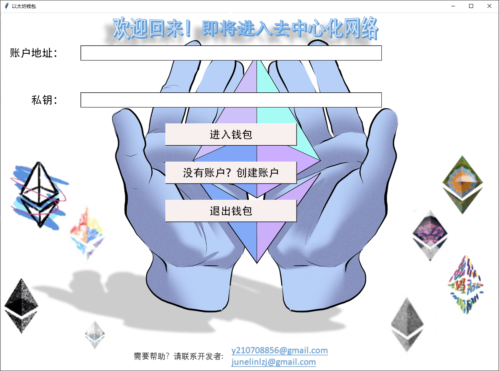
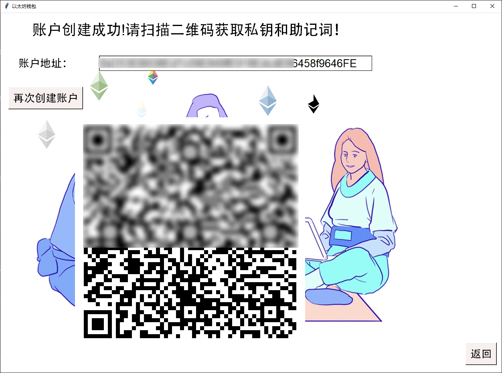
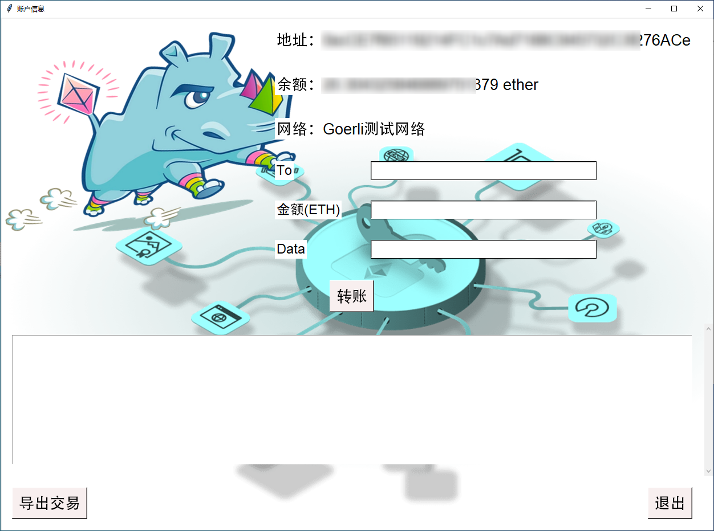

# 一个以太坊钱包

这是一个使用 `Web3.py` 库实现的以太坊钱包。它能够连接以太坊主网和各种主流测试网，并且具有简单的交互界面。

## 主要依赖

主要依赖的库有：

- `web3` （6.0及以上版本）
- `mnemonic`
- `qrcode`
- `PIL`
- `tkinter`

## Ethereum API注册

您需要在 `https://www.infura.io/zh` 上注册一个API密钥，以便对以太坊进行操作。

## 实现的功能

这个钱包实现了以下功能：

1. 余额查询
2. 账户创建，私钥和助记词以二维码的方式显示
3. 发送交易
4. 交易详细记录显示
5. 导出交易收据，您的交易收据将会导入到transaction_history文件夹中

## 待实现的功能

这个钱包还有一些待实现的功能：

1. 登录界面的改进，自定义登录账号和密码
2. 支持不同币种的查询及转账
3. 交易收据的签名及发送，实现转账通知功能
4. 实现账号内多账户的管理
5. NFT的管理和交易

## 钱包界面

### 1. 登录界面

### 2. 账户创建界面

### 3. 账户创建成功界面

### 4. 账户详情和交易界面

## 注意事项

1. 该钱包仅供学习和教学使用，未做安全分析，如在账户管理和交易时发生资产的丢失或被盗取，本人概不负责，尽请谅解。
2. 该钱包项目不用作任何商业用途。
## 声明
钱包界面图片来源：https://ethereum.org/zh/
如有侵权，请联系开发者：`y210708856@gmail.com`。
##

如果对该钱包项目满意，请点亮您的小星星，或者给开发者一点支持。我们的以太坊地址是：`0xecf8299086A7658316c8a526A14953878ed6049A`。
